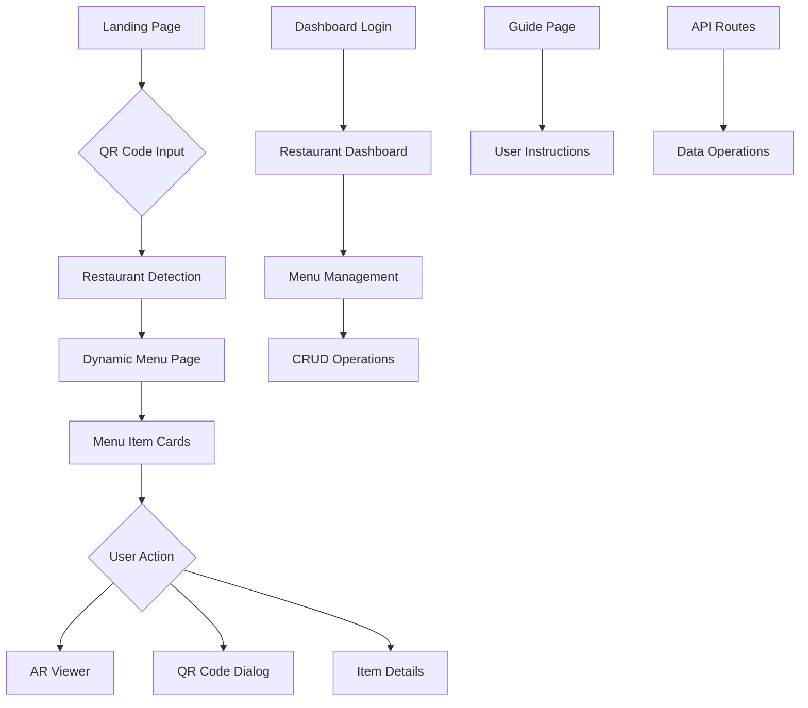

# AR Restaurant Menu - Developer Documentation

## 📋 Table of Contents

- [Project Overview](#project-overview)
- [Technology Stack](#technology-stack)
- [Architecture & Flow](#architecture--flow)
- [Project Structure](#project-structure)
- [Core Modules](#core-modules)
- [Page Implementations](#page-implementations)
- [Component Architecture](#component-architecture)
- [Data Layer](#data-layer)
- [AR Implementation](#ar-implementation)
- [Authentication & Multi-tenancy](#authentication--multi-tenancy)
- [Development Setup](#development-setup)
- [Deployment Guide](#deployment-guide)

## 🚀 Project Overview

The AR Restaurant Menu is a cutting-edge web application that combines traditional restaurant menu browsing with immersive Augmented Reality (AR) experiences. Built with Next.js 14+ and Material-UI, it provides a multi-tenant platform where multiple restaurants can showcase their menus with interactive 3D food models.

### Key Features

- **WebAR Integration**: View 3D food models in augmented reality using A-Frame and AR.js
- **Multi-tenant Support**: Multiple restaurants with isolated data and custom branding
- **QR Code System**: Contactless menu access via QR codes
- **Responsive Design**: Mobile-first approach with Material-UI components
- **Real-time Search**: Fuzzy matching search with category filtering
- **Restaurant Dashboard**: Complete CRUD operations for menu management
- **Progressive Web App**: PWA capabilities with offline support

## 🛠 Technology Stack

### Frontend Framework

- **Next.js 15.4.4** - React framework with App Router
- **React 19.1.0** - UI library with latest features
- **TypeScript 5.x** - Static type checking

### UI/UX Libraries

- **Material-UI (MUI) 7.2.0** - Component library and design system
- **@mui/icons-material** - Icon components
- **@emotion/react & @emotion/styled** - CSS-in-JS styling

### WebAR Technologies

- **A-Frame 1.7.1** - Web framework for building virtual reality experiences
- **AR.js 2.2.2** - Augmented reality library for the web
- **Three.js 0.178.0** - 3D graphics library

### Additional Libraries

- **react-qr-code 2.0.18** - QR code generation
- **qrcode.react 4.2.0** - Alternative QR code library

### Development Tools

- **ESLint 9.x** - Code linting
- **TypeScript Types** - Enhanced type safety

## 🏗 Architecture & Flow

### Application Flow



### Request Flow

1. **Entry Point**: Users access via QR code scan or direct URL
2. **Restaurant Resolution**: System identifies restaurant by secret/domain
3. **Menu Loading**: API fetches restaurant-specific menu data
4. **AR Integration**: WebAR components load 3D models on demand
5. **Data Persistence**: Mock database simulates real backend operations

## 📁 Project Structure

```
ar-menu/
├── src/
│   ├── app/                     # Next.js App Router pages
│   │   ├── layout.tsx          # Root layout with theme provider
│   │   ├── page.tsx            # Landing page (multi-tenant)
│   │   ├── api/
│   │   │   └── menu/
│   │   │       └── route.ts    # Menu API endpoint
│   │   ├── ar/[id]/
│   │   │   └── page.tsx        # Direct AR experience
│   │   ├── auth/
│   │   │   └── login/
│   │   │       └── page.tsx    # Authentication page
│   │   ├── dashboard/
│   │   │   └── page.tsx        # Restaurant management
│   │   ├── guide/
│   │   │   └── page.tsx        # User guide/help
│   │   ├── item/[id]/
│   │   │   └── page.tsx        # Individual item view
│   │   └── menu/[restaurant]/
│   │       └── page.tsx        # Dynamic restaurant menu
│   ├── components/             # Reusable React components
│   │   ├── ARViewer.tsx        # WebAR component
│   │   ├── MenuCard.tsx        # Menu item display
│   │   ├── QRCodeDialog.tsx    # QR code generation
│   │   ├── LanguageDialog.tsx  # Multi-language support
│   │   └── RestaurantInfoDialog.tsx
│   ├── data/                   # Mock data and JSON files
│   │   ├── menuData.ts         # Static menu data
│   │   └── *.json              # Mock API responses
│   ├── lib/                    # Utility libraries
│   │   ├── auth.ts             # Authentication logic
│   │   └── database.ts         # Mock database operations
│   └── types/                  # TypeScript definitions
│       ├── index.ts            # Main type exports
│       ├── aframe.d.ts         # A-Frame type definitions
│       └── ar.d.ts             # AR-specific types
├── public/                     # Static assets
│   ├── images/                 # Food images
│   ├── models/                 # 3D GLB models
│   └── manifest.json           # PWA manifest
└── __data__/                   # Additional data storage
```

## 🧩 Core Modules

### 1. Authentication Module (`/src/lib/auth.ts`)

- Mock authentication system
- Role-based access (restaurant owners, admins)
- Session management simulation

### 2. Database Module (`/src/lib/database.ts`)

- Mock database operations
- CRUD functions for restaurants, menu items, categories
- Multi-tenant data isolation
- TypeScript-safe operations

### 3. AR Integration (`/src/components/ARViewer.tsx`)

- A-Frame scene management
- AR.js marker-based tracking
- 3D model loading and rendering
- Camera permission handling
- Device compatibility checks

### 4. QR Code System (`/src/components/QRCodeDialog.tsx`)

- Dynamic QR code generation
- Menu-specific and item-specific codes
- Social sharing integration
- Download functionality

### 5. Multi-tenant Architecture

- Restaurant-specific themes and branding
- Isolated data per restaurant
- Custom domain support
- Secure access via secrets

## 📄 Page Implementations

### Landing Page (`/src/app/page.tsx`)

**Purpose**: Multi-tenant platform entry point
**Features**:

- Restaurant discovery
- QR code input for direct access
- Platform feature showcase
- Device compatibility information

**Key Implementation Details**:

- Uses `home_mock.json` for dynamic content
- Restaurant cards with custom theming
- Icon mapping system for dynamic UI
- Responsive grid layout with Material-UI

### Dynamic Menu Page (`/src/app/menu/[restaurant]/page.tsx`)

**Purpose**: Restaurant-specific menu display
**URL Pattern**: `/menu/[restaurant]?r=secret` or `/menu/[restaurant]?restaurantId=id`

**Key Features**:

- Dynamic restaurant resolution
- Real-time search with fuzzy matching
- Category-based filtering
- AR model integration
- QR code generation per item

**Implementation Highlights**:

```typescript
// Restaurant resolution logic
const restaurantParam = params.restaurant as string;
const restaurantSecret = searchParams.get("r");
const restaurantId = searchParams.get("restaurantId");

// Fuzzy search implementation
const fuzzyMatch = (text: string, search: string) => {
  const str = text.toLowerCase();
  const searchStr = search.toLowerCase();
  // Flexible character matching algorithm
};
```

### AR Experience Page (`/src/app/ar/[id]/page.tsx`)

**Purpose**: Direct AR viewer for specific items
**Features**:

- Immediate AR model loading
- Item information overlay
- Navigation controls
- Error handling for unsupported devices

### Dashboard Page (`/src/app/dashboard/page.tsx`)

**Purpose**: Restaurant owner menu management
**Features**:

- Menu item CRUD operations
- Category management
- Analytics overview
- Bulk operations

**Implementation**:

- Form validation with TypeScript
- Image upload simulation
- Real-time data updates
- Modal-based editing interface

### Guide Page (`/src/app/guide/page.tsx`)

**Purpose**: Comprehensive user guide
**Features**:

- Step-by-step AR instructions
- Interactive tutorials
- Troubleshooting guides
- Feature explanations

## 🎨 Component Architecture

### MenuCard Component (`/src/components/MenuCard.tsx`)

**Responsibility**: Display individual menu items
**Features**:

- Image lazy loading with skeleton
- Dietary information badges
- AR availability indicators
- Price formatting
- Action buttons (AR view, QR code)

**Props Interface**:

```typescript
interface MenuCardProps {
  item: MenuItem;
  onViewAR: (item: MenuItem) => void;
  onShowQR: (item: MenuItem) => void;
}
```

### ARViewer Component (`/src/components/ARViewer.tsx`)

**Responsibility**: WebAR functionality
**Key Implementation**:

- A-Frame scene initialization
- AR.js integration
- 3D model loading
- Camera controls
- Error boundary handling

```typescript
// AR scene setup
useEffect(() => {
  if (open && modelPath) {
    const scene = document.createElement("a-scene");
    scene.setAttribute("embedded", true);
    scene.setAttribute("arjs", "trackingMethod: best; sourceType: webcam;");
    // Additional AR configuration
  }
}, [open, modelPath]);
```

## 💾 Data Layer

### Mock Data Structure

The application uses a sophisticated mock data system that simulates a real backend:

**Restaurant Data** (`/src/lib/database.ts`):

```typescript
interface Restaurant {
  id: string;
  name: string;
  description: string;
  logo: string;
  address: string;
  phone: string;
  website: string;
  ownerId: string;
  isActive: boolean;
  subscriptionPlan: string;
  qrCodeSecret: string;
  customDomain: string;
  theme: RestaurantTheme;
  createdAt: Date;
}
```

**Menu Item Structure**:

```typescript
interface MenuItem {
  id: string;
  name: string;
  description: string;
  price: number;
  image: string;
  category: string;
  model3D?: string; // Path to GLB model
  allergens?: string[];
  spicyLevel?: number;
  isVegetarian?: boolean;
  isVegan?: boolean;
  isActive?: boolean;
  restaurantId?: string;
}
```

### JSON Mock Files

- `home_mock.json` - Landing page content
- `menu_mock.json` - Menu page configurations
- `ar_mock.json` - AR interface settings
- `dashboard_mock.json` - Dashboard UI content
- `guide_mock.json` - User guide content
- `auth_mock.json` - Authentication flows

## 🥽 AR Implementation

### A-Frame Integration

The AR functionality is built on A-Frame with AR.js for marker-based tracking:

```typescript
// AR Scene Configuration
const arScene = {
  embedded: true,
  arjs: "trackingMethod: best; sourceType: webcam; debugUIEnabled: false;",
  "vr-mode-ui": "enabled: false",
  "gesture-detector": true,
};

// Model Loading
const modelEntity = document.createElement("a-gltf-model");
modelEntity.setAttribute("src", modelPath);
modelEntity.setAttribute("scale", "0.5 0.5 0.5");
modelEntity.setAttribute("position", "0 0 0");
```

### 3D Model Requirements

- **Format**: GLB (GL Transmission Format)
- **Size**: Optimized for web loading (<2MB recommended)
- **Textures**: Compressed for mobile devices
- **Polycount**: <10k triangles for smooth performance

### AR Features

- Marker-based tracking
- Gesture controls (pinch to scale, rotate)
- Surface detection
- Real-time rendering
- Cross-platform compatibility

## 🔐 Authentication & Multi-tenancy

### Restaurant Isolation

Each restaurant operates in an isolated environment:

```typescript
// Data isolation by restaurant ID
export const getMenuItemsByRestaurant = async (restaurantId: string) => {
  return mockMenuItems.filter((item) => item.restaurantId === restaurantId);
};

// Secure access via QR codes
export const getRestaurantBySecret = async (secret: string) => {
  return mockRestaurants.find((r) => r.qrCodeSecret === secret);
};
```

### Access Control

- QR code-based authentication
- Restaurant owner dashboards
- Role-based permissions
- Secure API endpoints

## 🛠 Development Setup

### Prerequisites

- Node.js 18+
- npm or yarn
- Modern browser with WebRTC support

### Installation

```bash
# Clone repository
git clone <repository-url>
cd ar-menu

# Install dependencies
npm install

# Start development server
npm run dev

# Build for production
npm run build
```

### Environment Variables

```env
# Add to .env.local
NEXT_PUBLIC_APP_URL=http://localhost:3000
NEXT_PUBLIC_AR_DEBUG=false
```

### Development Commands

```bash
npm run dev          # Start development server
npm run build        # Build for production
npm run start        # Start production server
npm run lint         # Run ESLint
```

## 🚀 Deployment Guide

### Production Build

```bash
# Build optimized bundle
npm run build

# Test production build locally
npm run start
```

### Deployment Checklist

- [ ] Environment variables configured
- [ ] 3D models optimized and uploaded
- [ ] HTTPS enabled (required for camera access)
- [ ] PWA manifest configured
- [ ] Error monitoring setup
- [ ] Performance optimization
- [ ] SEO meta tags configured

### Platform-Specific Notes

**Vercel Deployment**:

- Automatic deployment from Git
- Edge functions for API routes
- Built-in analytics and monitoring

**Server Requirements**:

- Node.js 18+
- HTTPS certificate
- CDN for 3D models
- Database for production data

## 📊 Performance Considerations

### Optimization Strategies

- **Image Optimization**: Next.js Image component with lazy loading
- **3D Model Compression**: GLB format with Draco compression
- **Code Splitting**: Dynamic imports for AR components
- **Caching**: API response caching and static asset CDN
- **Bundle Analysis**: Regular bundle size monitoring

### Mobile Performance

- Touch-optimized controls
- Reduced model complexity for mobile
- Efficient texture compression
- Battery usage optimization

## 🧪 Testing Strategy

### Component Testing

- Unit tests for utility functions
- Component testing with React Testing Library
- AR functionality testing with mock WebRTC

### Integration Testing

- API endpoint testing
- Multi-tenant data isolation verification
- QR code generation and validation

### Performance Testing

- 3D model loading performance
- Mobile device compatibility
- Network condition testing

## 🔧 Troubleshooting

### Common Issues

**AR Not Working**:

- Check camera permissions
- Verify HTTPS connection
- Test device compatibility
- Ensure adequate lighting

**3D Models Not Loading**:

- Verify GLB file format
- Check file size (<5MB)
- Validate model optimization
- Test network connectivity

**QR Codes Not Scanning**:

- Verify QR code data format
- Check restaurant secret validity
- Test with different QR readers

## 📚 Additional Resources

### Documentation Links

- [Next.js Documentation](https://nextjs.org/docs)
- [Material-UI Documentation](https://mui.com)
- [A-Frame Documentation](https://aframe.io/docs)
- [AR.js Documentation](https://ar-js-org.github.io/AR.js-Docs/)

### Development Tools

- React Developer Tools
- Material-UI Theme Creator
- Blender for 3D model creation
- glTF Validator for model optimization

---

**Version**: 1.0.0  
**Last Updated**: January 2025  
**Contributors**: AR Menu Development Team
